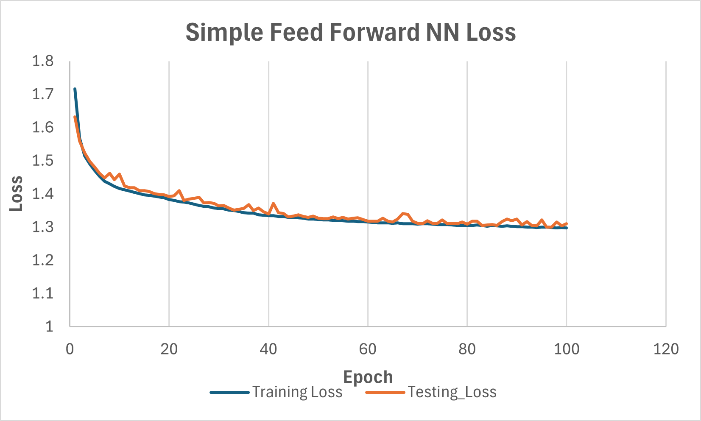

# BandGap_ML
### Introduction
The band gap is a fundamental property in materials science which plays a significant role in determining the applications of a material in fields such as optoelectronics, quantum computing, etc. The process of determining the band gap of a material through direct means (opticalabsorption spectroscopy, photoluminescence spectroscopy, and photoconductivity measurements) or indirect means involving theoretical calculations (Density Functional Theory) requires significant time and capital investment. 
### Current Results
A simple Feed Forward Neural Network (FFNN) showed promising results in predicting the band gap of crystalline materials. Further experimentation with different models, learning rates and data samples is needed to improve accuracy to a sufficient degree.

  

